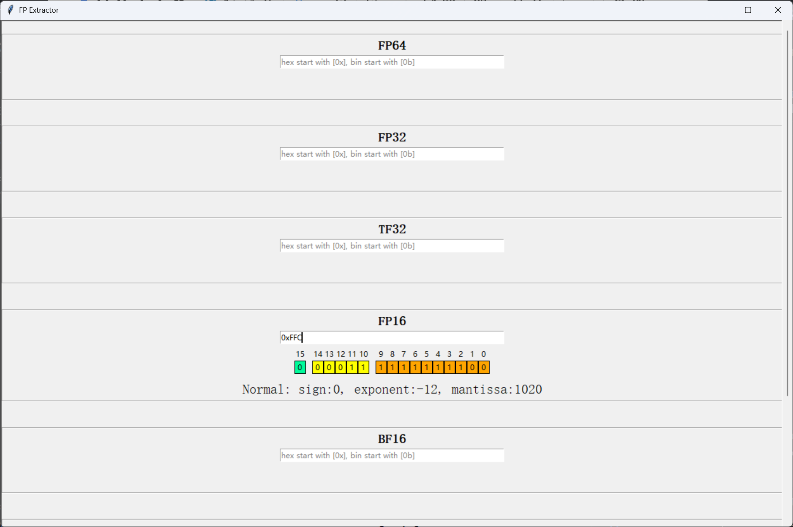

# FP Extractor



输入16进制或2进制数字，提取指定格式的符号，指数和尾数

## 环境要求

* python >= 3.8
* 已安装tkinter

## 使用方法

```
git clone https://github.com/jackkyyang/fp_extractor.git
python ./fp_extractor/fp_extractor.py
```
